

  

  

  

  

<!-- AI Terminal-style animated intro -->

  

  

  

<table>
<tr>
<td width="30%" align="center" valign="middle">
  
</td>
<td width="70%">

</td>
</tr>
</table>

  

| 🔬 Research | 🏆 Competitions/Events | 👩‍💻 Club Work |
|:---|:---|:---|
| Summer Research Intern - CDSAML | 🚩 Capture The Flag (CTF) | AURA - Socials and Outreach |
| | 🧩 Mystara Hackathon | Samarpana - Hospitality Team Member - Indian Army Martyrs Felicitation |
| | ⚡ Genesys - State Level Hackathon | IRA - Operations and Marketing |
| | 🌏 IBM Global Datathon | Kannada Koota - Guitarist |
| | 🎃 Hack-O-Ween - 24 Hour Hackathon - Top 10 Finalist | Music Club of PES - Musician |
| | 🇮🇳 GRASP - National Hackathon | |
| | 💡 CIE SPARK - Top 20 Finalist - Entrepreneurial Ideathon | |
| | 🥈 Runner's Up - Badminton | |
| | 🎼 Battle Of Bands - Aatmatrisha College Fest - 2025 | |

  

  <i><b>"Never underestimate the power of 1%. If there’s even the smallest chance of becoming better, give it everything you’ve got. You never know how far 100% effort can take that 1%"</b></i>

  

<table>
<tr>
<td width="50%" valign="top">

🛡️ <b>HarmLens</b> — Real-time Content Moderation Engine

 

API-first content moderation system built for social platforms — processes millions of posts automatically, routes flagged content to moderation queues, and triggers real platform actions.

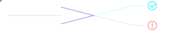

</td>
<td width="50%" valign="top">

🐾 <b>PetMatchAI</b> — RAG-Based Personalized Pet Recommendation System <i>[Currently Working]</i>

 

A Retrieval-Augmented Generation based system that personalizes pet recommendations to match users with their ideal companion.


</td>
</tr>
<tr>
<td width="50%" valign="top">

🏥 <b>RecovAI</b> — Predictive Surgical Recovery Assistant

 

Full-stack application predicting surgical complications using machine learning, with dual doctor/patient portals and an AI-powered 24/7 recovery assistant.

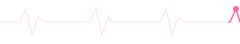

</td>
<td width="50%" valign="top">

🎖️ <b>Mission Parakram</b> — Tri-Service OSINT Dashboard <i>[Currently Working]</i>

 

A Tri-Service OSINT dashboard built to aggregate and visualize open-source intelligence across defense domains.


</td>
</tr>
<tr>
<td width="50%" valign="top">

🧠 <b>NeuroSense</b> — EEG-based Seizure Detection

 

Detects epileptic seizures from EEG signals using a 1D Convolutional Neural Network — extendable to real-time alerts and wearable healthcare devices.

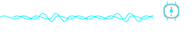

</td>
<td width="50%" valign="top">

🎧 <b>EchoNav</b> — Audio-Guided Assistive Navigation

 

AI-based assistive navigation for visually impaired individuals — real-time object detection mapped to audio feedback for safer, more intuitive movement.


</td>
</tr>
</table>

  

**Programming Languages**

  
  
  
  
  
  

**ML / AI & Tools**

  
  
  
  
  
  

**Core CS & Domains**

  
  
  
  
  

**Areas of Interest**

  
  
  

**Databases**

  
  
  
  
  

**Deployments**

  
  
  
  

---

  

  
  

  

  

<!-- Animated contribution snake -->

  

  

  
  
  
  

  

<i>✨ Thank you :) ✨</i>

